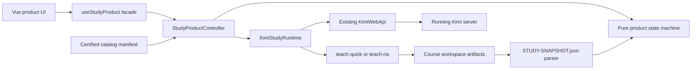
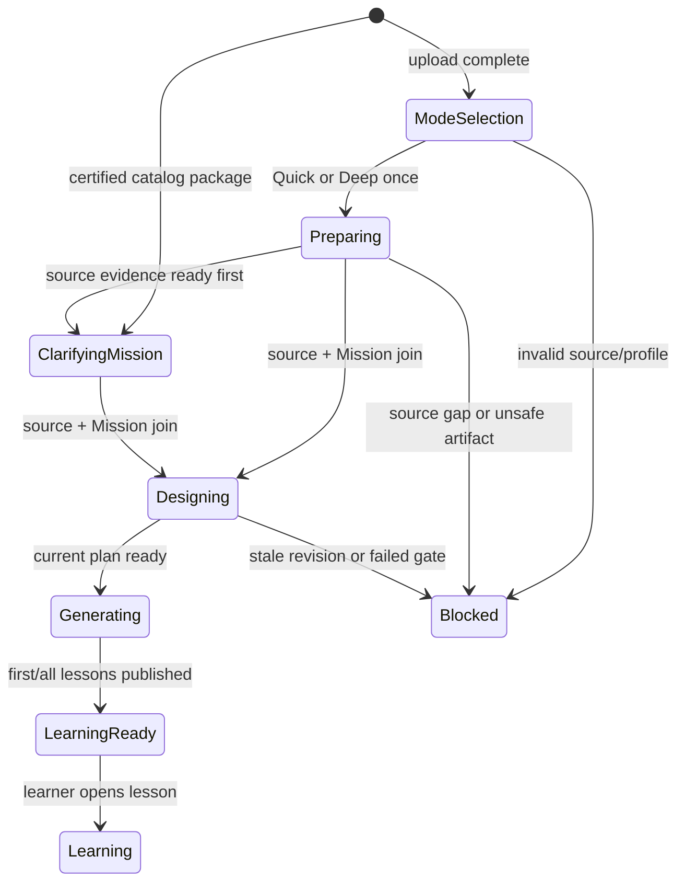

# Kimi Study 0→0.5 foundation architecture

Status: implemented foundation, UI integration pending

Branch: `feat/kimi-study-foundation`

Worktree: `/home/yuyu/kimi-code-study-foundation`

Product contract: `kimi-study-foundation-v1`

## Outcome

This foundation turns Kimi Study's competitive thesis into code boundaries:

> Start from what the learner wants to understand, build attributable understanding of that material, clarify why this learner is here, then generate a course from the joined evidence.

It deliberately does not implement the Coursebox UI. The next agent owns the 0.5→1 presentation and full journey, but it should not need to redesign product state, Kimi API orchestration, Skill routing, catalog trust, or learner decision policy.

The existing product analysis report is intentionally unchanged. This document explains the implementation contract and handoff.

## Competitive product shape

Coursebox is strong at low-friction course authoring, familiar outline editing, generation feedback, learner navigation, assessment, sharing, and an in-context tutor. Its default topic/prompt start also makes it easy to generate a plausible course before the system has deeply understood the learner's actual material.

Kimi Study competes by keeping Coursebox's interaction quality while changing the source of truth:

| Moment | Kimi Study rule | Competitive effect |
|---|---|---|
| Entry | Upload material or select a certified prepared source | Starts from evidence, not a plausible topic sentence |
| Uploaded material | One Quick/Deep choice; Quick recommended | Low decision burden without pretending every source deserves deep study |
| Prepared source | No mode choice; source work is already Deep-certified | Near-instant start for common textbooks while retaining evidence |
| Source work | Mission interview runs concurrently | Long reading time becomes productive personalization time |
| Internal analysis | Auto-policy approval after strict gates | Removes expert decisions without removing quality controls |
| Outline | Built only from current source + Mission revisions | Prevents generic or stale courses |
| Learning | Course tree + content + contextual tutor | Matches the familiar learner journey where Coursebox is strongest |
| Upgrade | Quick can become Deep without re-upload | Lets exploration convert into committed study |

Preprocessed material is not a prebuilt generic course. It is a reusable, source-bound understanding package. Each learner still produces a fresh Mission, blueprint, teaching map, lessons, progress, and tutor context.

## Architecture



Dependencies point inward:

- domain code is pure and knows nothing about Vue, HTTP, sessions, or chat;
- runtime depends on the domain contract and existing `KimiWebApi`;
- Controller depends on a runtime port, so UX actions can be tested without a server;
- Vue consumes one facade and does not receive developer controls;
- agent output crosses a parser/invariant boundary before becoming UI state.

## Implemented code map

### Domain and trust

- `src/study/domain/courseContract.ts`: modes, evidence, source/Mission/plan/generation axes, approvals, snapshot types.
- `src/study/domain/courseState.ts`: constructors, transitions, derived phases, join gate, revision gate, invariants.
- `src/study/domain/courseArtifact.ts`: bounded JSON parsing; malformed/unsupported/unsafe results never become ready.
- `src/study/domain/catalogPackage.ts`: content-addressed prepared-source manifest and nominal `CertifiedCatalogMaterial`.
- `src/study/domain/studyPolicy.ts`: Skill pins, Mission question budgets, public-copy guard, activation policy.

### Runtime and product actions

- `src/study/runtime/courseRegistry.ts`: browser-local session/workspace/operation pointers only.
- `src/study/runtime/studyRuntime.ts`: UI-independent port and native question-card validation.
- `src/study/runtime/kimiStudyRuntime.ts`: launcher bootstrap, session creation, Skill pin verification, upload/prompt, snapshot reads, WebSocket events, questions, generation.
- `src/study/product/studyProductController.ts`: upload, select mode, catalog start, open/resume, answer/skip, generate, upgrade, refresh.
- `src/study/composables/useStudyProduct.ts`: Vue lifecycle wrapper with no model/permission/developer surface.
- `src/study/foundation.ts`: stable public import surface for the UI agent.

### Existing API extension

- `KimiWebApi.makeDirectory` maps the existing `POST /sessions/{id}/fs:mkdir` endpoint.
- It is used only after a launcher session is created at the existing workspace root.

### Runtime Skills

- `study-skills/teach-quick`: Matt Pocock teach lineage, productized for material-first end-to-end survey, 0–1 Mission question, fast outline, honest survey evidence.
- `study-skills/teach-ria`: Sebastian `9ea4ed8` lineage, preserving whole reading + RIA-TV++ + lossless blueprint + lesson publication gates.
- `study-skills/install-study-skills.py`: verified, atomic install; no overwrite by default.
- `teach-ria/scripts/build-catalog-package.py`: source-only, content-addressed package manifest for common textbooks.

## State model

Source, Mission, plan, and generation are orthogonal facts. The visible phase is derived; the agent does not get to declare a friendly phase string.



Key invariants enforced in code:

1. A new upload is the only state with no profile and exactly one mode decision.
2. Quick can use only `none|survey` evidence and cannot contain reading/RIA fields.
3. Deep certification requires 100% coverage, zero blocked ranges, reading certificate revision, and ready RIA revision.
4. Quick Mission is 0–1 questions; Deep/Prepared Mission is 2–4.
5. A plan cannot be ready until source and Mission are ready.
6. A plan names the exact source and Mission revisions; generation names the exact plan revision.
7. Auto approval is recorded as `auto_policy`, never forged as user confirmation.
8. Prepared material must pass manifest hashes/checks before receiving the certified nominal type.
9. Internal workflow vocabulary is rejected in public copy and native question cards.

## Workspace and API orchestration

Workspace root: `/home/yuyu/kimi-study-workspace`

Course start is deterministic:

1. Upload file through `POST /api/v1/files`.
2. Create or recover a launcher session whose cwd is the existing workspace root.
3. Create the deterministic course subdirectory with `fs:mkdir`.
4. Create or recover a course session whose cwd is that exact directory.
5. List Skills and require both name and `[contract:revision]` marker.
6. Activate `teach-quick` or `teach-ria` with product constraints.
7. Submit the material/file block and workflow prompt with `permissionMode: auto`.
8. Persist a product operation id in prompt metadata and the local pointer registry.
9. On retry, inspect registry/session messages before submitting another operation.
10. Subscribe from the atomic session snapshot cursor; refresh product artifacts when a turn becomes idle or resyncs.

The runtime validates course ids and refuses `/` as a workspace root. It catches only the known `FS_ALREADY_EXISTS` race; other errors remain visible.

## Product artifacts

### `source/STUDY-SNAPSHOT.json`

This single bounded JSON document is the UI read model. It includes identity, pinned profile, source evidence, Mission, plan, generation, approvals, and revisions. The frontend parser discards unknown trust claims and runs semantic invariants.

Markdown artifacts remain audit truth for the teaching engine. The snapshot is their product projection, not a replacement for reading ledgers, RIA units, blueprints, maps, or lesson briefs.

### Certified prepared source

`kimi-study-package-v1` requires:

- immutable package and source SHA-256 references;
- reading coverage 100%, no blocked ranges, certificate revision;
- ready RIA revision;
- checksums for reading state, overview, distillation, and RIA index;
- approvals covering reading and RIA revisions.

The package has no Mission or course plan. A later catalog/index can store presentation metadata, but the immutable manifest remains the trust input.

## UX contract for 0.5→1

The next agent should implement screens against `StudyProductView`, not mock a second flow.

### 1. Home

- Primary entry: upload learning material.
- Secondary entry: prepared textbook/material catalog.
- Do not center the product on a free-form “what do you want to create?” prompt.
- Course/library sidebar can borrow Coursebox's disclosure and continuation behavior.

### 2. Upload decision

Show once after successful upload:

- Quick (recommended): “I am still deciding; give me the fastest honest path through all of it.”
- Deep: “This is a textbook/course/exercise source I am committed to mastering.”

Do not ask this for a certified catalog package.

### 3. Preparation + Mission

- Present source progress and Mission questions in one continuous surface.
- Quick asks at most one question; Deep asks 2–4 one-card-at-a-time questions.
- User message is a right-aligned neutral bubble; agent explanation has no heavy bubble; question card is the focused bottom action.
- Never show internal approvals, decomposition review, RIA terminology, raw tools, or a developer conversation header.

### 4. Outline

- Enter automatically after source/Mission join.
- Main area: title, description, counts, chapter accordion, child page type chips, edit affordances.
- Contextual tutor/creation rail can mirror Coursebox's useful outline-chat pattern, but every mutation must create a new plan revision.
- Generate button targets the visible exact revision.

### 5. Generation and learner

- Show lesson-level incremental readiness; do not block the entire course when the first safe lesson is ready.
- Learner view: numbered chapter tree, completed state, course progress, hero/header, content, previous/next.
- Tutor drawer always carries current course, lesson, and source-anchor context. It must not expose session/model/permission controls.

### 6. Upgrade

Offer Deep upgrade after a Quick survey when the learner commits. Preserve upload identity and quick survey; reset source certification, plan, and generation. Do not present upgrade as if Quick was deficient or fake.

## Handoff environment

The next implementation agent may fully use:

```bash
ssh -o BatchMode=yes yuyu@100.70.160.30 'command'
```

Before any write, inspect worktrees and dirty status. In particular, do not touch the dirty `feat/kimi-study-frontend` or Coursebox comparison worktree unless ownership is explicitly transferred.

Relevant runtime:

- Kimi server: `http://100.70.160.30:58637`
- API base: `http://100.70.160.30:58637/api/v1`
- token: `/home/yuyu/.local/share/kimi-study/server.token` (never print it)
- workspace root: `/home/yuyu/kimi-study-workspace`
- Skill install root: `/home/yuyu/.agents/skills`

Observed on 2026-07-17:

- health is ready;
- backend is v2;
- server capabilities include WebSocket, file upload, and fs query;
- auth reports `ready: false`, `providers_count: 0`, `default_model: null`;
- a new probe session discovers `teach`, `teach-quick`, and `teach-ria` with correct contract markers.

Do not claim or attempt a full generated-course E2E until provider login is restored. Readiness and all non-model runtime paths can still be tested.

## 0→0.5 completed

- Material-first domain contract and product invariants.
- Quick, Deep, and Prepared source profiles.
- Mission decision budgets and internal-copy guard.
- Conservative artifact parser.
- Certified catalog manifest parser and source-only package builder.
- Existing Kimi REST/WS runtime adapter.
- Launcher directory bootstrap through existing API.
- Prompt/session idempotency seam.
- Native AskUserQuestion product boundary.
- Version-pinned, deployable Quick/RIA Skills.
- Controller and Vue composable facade.
- Focused unit tests plus Skill/checker tests.

## 0.5→1 recommended order

1. Replace Study demo state with `useStudyProduct`; keep existing demo behind a dev-only fixture if useful.
2. Implement product readiness/login state without exposing developer controls.
3. Build material home/upload/catalog and Quick/Deep selection.
4. Bind WebSocket question cards and parallel preparation progress.
5. Build outline from snapshot + workspace artifacts; add revisioned edits.
6. Bind generation, partial lesson publication, and recovery states.
7. Build Coursebox-parity learner view and contextual tutor drawer.
8. Add catalog index/storage on existing fs/session APIs; do not add backend code unless constraints change.
9. Run real authenticated end-to-end journeys for Quick upload, Deep upload, prepared catalog, Quick→Deep, stale plan rejection, reconnect, and tutor context.
10. Only then do screenshot/animation parity passes against the Coursebox journey.

## Known limits, not hidden work

- No UI or animations were implemented in this foundation.
- `main.ts` product mounting was not changed because another agent owns overlapping frontend work.
- No new backend endpoint or service was added.
- Catalog storage/indexing is not implemented; the immutable package producer/parser contract is.
- The live server is not provider-authenticated, so model activation/generation E2E is blocked by environment, not silently marked passed.
- Runtime version verification uses the Skill description contract marker because the current public Skill descriptor has no content digest field.

## Verification and atomic commits

From `apps/kimi-web`:

```bash
npm run typecheck
npm test
npm run check:style
```

From `apps/kimi-web/study-skills`:

```bash
python3 -m unittest discover -s teach-quick/tests -p 'test_*.py'
python3 -m unittest discover -s teach-ria/tests -p 'test_*.py'
python3 test_install_study_skills.py
```

Proposed commit boundaries—ask before each commit:

1. `feat(kimi-web-api): expose session fs mkdir`
2. `feat(study-domain): define material-first course contracts and gates`
3. `feat(study-runtime): add resumable Kimi runtime and product facade`
4. `feat(study-skill): add versioned quick-survey workflow`
5. `feat(study-skill): add versioned deep RIA workflow and catalog package builder`
6. `chore(study-skill): add atomic validated skill installer`
7. `docs(study): define UX, architecture, and implementation handoff`

Never collapse these into one commit.
